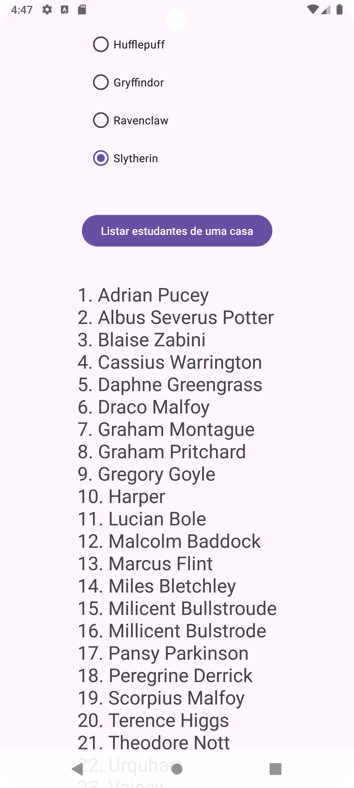

UFPR – Universidade Federal do Paraná

Setor de Educação Profissional e Tecnológica

Especialização em Desenvolvimento Ágil de Software

MOB2 - Desenvolvimento Mobile II

Prof. Dr. Alessandro Brawerman

**Aluno: Alberto Sussumu Kato Junior**

<h1 align="center"> Trabalho da disciplina Desenvolvimento Mobile II </h1>

# GitHub
https://github.com/ASKJR/HpApp

# Contexto
O objetivo deste trabalho é consultar a HP-API para demonstrar os conhecimento
adquiridos em corrotinas e web services. A HP-API pode ser encontrada em:
https://hp-api.onrender.com/
Uma rápida utilização dos métodos oferecidos pela API, usando a interface Web disponível,
permite que o desenvolvedor entenda como consumir os endpoints que a mesma oferece.

# HpApp
### #1 Activity Principal - Dashboard
A activity principal deve apresentar um dashboard. Ela possui uma view com botões
(distribuídos de maneira bem equilibrada na interface) que devem levar o usuário a poder
executar as ações do aplicativo, sendo elas: Listar um personagem específico (por ID); Listar os
professores da escola; Listar os estudantes de uma casa; e sair (fecha o aplicativo).

  

### #2 Activity Listar um personagem específico
Deve permitir ao usuário informar um ID para a busca e usar o endpoint de busca da API.
Você encontra este endpoint ao clicar no botão “Specific Character by ID” na interface Web da
API. A resposta deve mostrar em um TextView os campos name e house do personagem.

  

### #3 Listar os professores da escola
Apresenta em um TextView o nome de todos os professores da escola. Você encontra este
endpoint ao clicar no botão “Hogwarts Staff” na interface Web da API.

  

### #4 Listar os estudantes de uma casa
Apresenta em um TextView o nome de todos os estudantes de uma determinada casa.
Faça uma view com Radio Buttons com os nomes da escola e permita que o usuário escolha
apenas 1 deles para a consulta. Você encontra este endpoint ao clicar no botão “Characters in a
House” na interface Web da API.

  

# Demo

